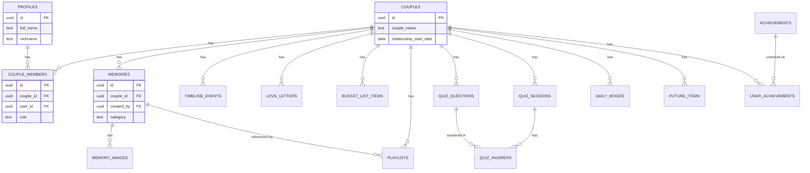
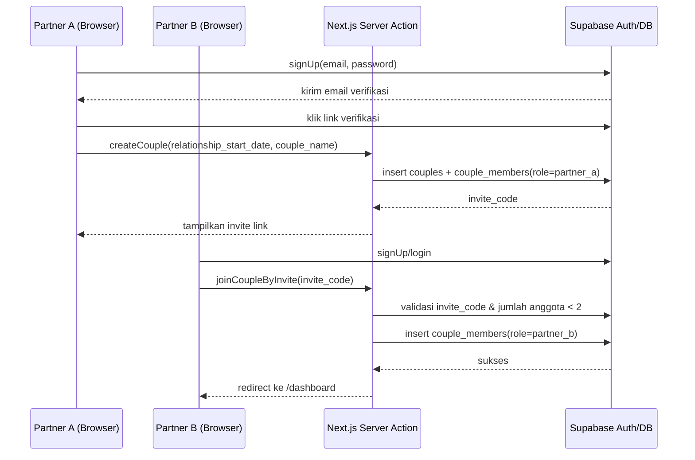
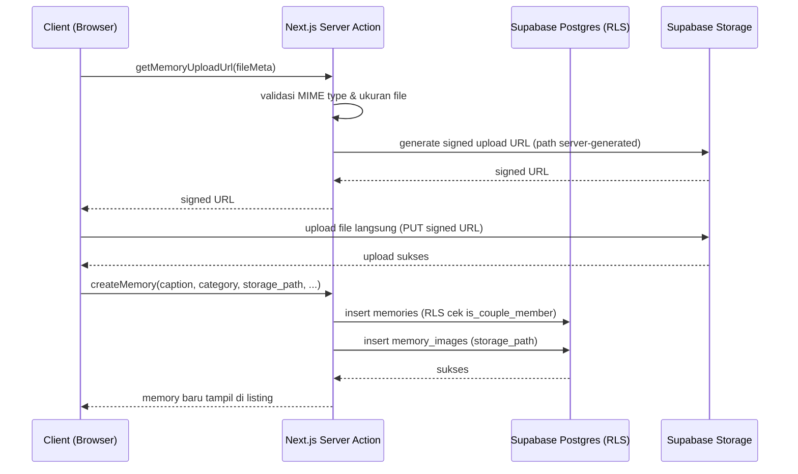
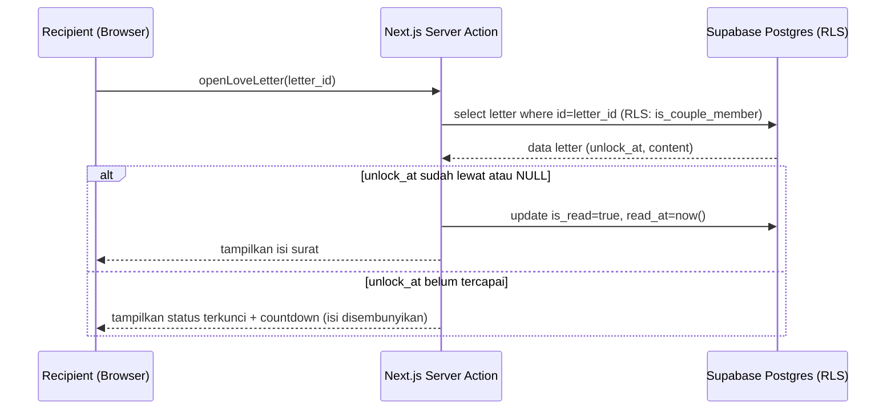
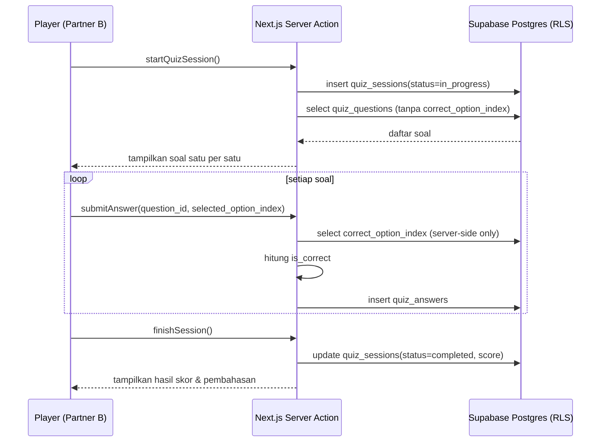

# PRD — Our Little World ❤️

*A tiny digital world that belongs only to us.*  
Private Couple Web Application — Product Requirement Document

**Versi Dokumen:** 1.0  
**Tanggal:** 5 September 2026  
**Stack Utama:** Next.js (TypeScript, App Router), Tailwind CSS, Supabase (Postgres, Auth, Storage, RLS), Vercel

# Document Information

| Atribut | Detail |
| --- | --- |
| Nama Produk | Our Little World |
| Jenis Dokumen | Product Requirement Document (PRD) |
| Versi | 1.0 |
| Tanggal | 5 September 2026 |
| Status | Draft — siap dijadikan blueprint development |
| Target Pembaca | Development team (frontend, backend, QA), designer |
| Stack Utama | Next.js (TypeScript, App Router), Tailwind CSS, Supabase (Postgres, Auth, Storage, RLS), Vercel |

## Revision History

| Versi | Tanggal | Deskripsi Perubahan |
| --- | --- | --- |
| 1.0 | 5 September 2026 | Draft awal PRD lengkap |

# Table of Contents

- [Document Information](#document-information)
- [Table of Contents](#table-of-contents)
- [1. Executive Summary](#1-executive-summary)
- [2. Tech Stack](#2-tech-stack)
- [3. Product Overview](#3-product-overview)
- [4. Product Goals](#4-product-goals)
- [5. Target Users](#5-target-users)
- [6. User Roles](#6-user-roles)
- [7. User Flow](#7-user-flow)
- [8. Functional Requirements](#8-functional-requirements)
- [9. Non-Functional Requirements](#9-non-functional-requirements)
- [10. Feature Specifications](#10-feature-specifications)
- [11. UX/UI Requirements](#11-uxui-requirements)
- [12. Technical Architecture](#12-technical-architecture)
- [13. Database Design](#13-database-design)
- [14. Sequence Diagrams](#14-sequence-diagrams)
- [15. Supabase Architecture](#15-supabase-architecture)
- [16. Authentication & Authorization](#16-authentication-authorization)
- [17. Security Requirements](#17-security-requirements)
- [18. API / Server Actions](#18-api-server-actions)
- [19. Route Structure](#19-route-structure)
- [20. Next.js Folder Structure](#20-nextjs-folder-structure)
- [21. Storage Architecture](#21-storage-architecture)
- [22. Performance](#22-performance)
- [23. Deployment](#23-deployment)
- [24. Environment Variables](#24-environment-variables)
- [25. Testing Strategy](#25-testing-strategy)
- [26. MVP Scope](#26-mvp-scope)
- [27. Development Roadmap](#27-development-roadmap)
- [28. Product Risks](#28-product-risks)
- [29. Future Scalability](#29-future-scalability)
- [30. Assumptions](#30-assumptions)
- [31. Acceptance Criteria](#31-acceptance-criteria)
- [32. Definition of Done](#32-definition-of-done)

# 1. Executive Summary

Our Little World adalah private couple web application: ruang digital tertutup untuk dua orang (couple) menyimpan kenangan, cerita, rencana, dan aktivitas harian mereka. Aplikasi dibangun di atas Next.js (App Router, TypeScript) dengan Supabase sebagai backend (Postgres, Auth, Storage) dan di-deploy di Vercel.

Karakter produk ini berbeda dari aplikasi couple pada umumnya: skala pengguna sangat kecil (satu couple = dua akun terautentikasi berbagi satu couple space), namun kebutuhan privasi dan keamanan datanya setara dengan aplikasi personal-data-sensitive pada umumnya. Karena itu prioritas desain: Product clarity → UX → Security → Maintainability → Performance → Scalability.

Boundary keamanan utama tidak berada di frontend, melainkan di PostgreSQL Row Level Security (RLS) yang memastikan seluruh data (memories, letters, mood, dsb.) hanya dapat diakses oleh dua anggota couple yang bersangkutan. Dokumen ini menjabarkan requirement fungsional, non-fungsional, skema database, kebijakan RLS, arsitektur API, dan roadmap pengembangan secara lengkap sehingga dapat langsung dijadikan blueprint implementasi.

# 2. Tech Stack

Stack berikut dipilih dan tidak diganti tanpa alasan teknis yang kuat, mengingat prioritas utama produk ini adalah simplicity dan maintainability untuk tim kecil/solo developer.

| Layer | Teknologi | Alasan Pemilihan |
| --- | --- | --- |
| Frontend + Backend runtime | Next.js 14+ (App Router, TypeScript, Server Components, Server Actions) | Satu framework untuk UI dan server logic — tidak perlu backend terpisah untuk aplikasi seukuran ini |
| Bahasa | TypeScript (strict mode) | Type-safety end-to-end antara schema Zod, tipe Supabase, dan komponen UI |
| Styling/UI | Tailwind CSS + komponen reusable custom | Konsisten, ringan, mudah menerapkan design direction (bagian 11) tanpa CSS terpisah |
| Database | PostgreSQL (dikelola Supabase) | Relational — cocok untuk data yang sangat terstruktur dan saling terhubung (couple, memories, dsb.) |
| Auth | Supabase Auth | Terintegrasi langsung dengan RLS Postgres, mendukung email verification & password reset bawaan |
| File storage | Supabase Storage | Terintegrasi dengan RLS/Auth yang sama, cukup untuk kebutuhan foto & lampiran |
| Validasi data | Zod | Schema tunggal dapat dipakai di client (form) maupun server (Server Action) untuk validasi konsisten |
| Hosting/Deployment | Vercel | Deployment native untuk Next.js, HTTPS otomatis, preview environment per pull request |
| Diagram teknis | Mermaid (ERD, sequence diagram) | Dapat disimpan sebagai teks di dokumentasi dan repo, mudah di-maintain seiring perubahan skema/flow |

Development principles yang diikuti selama implementasi: TypeScript strict mode, component-based architecture, reusable components, clean code, separation of concerns, secure by default, environment variables untuk seluruh konfigurasi sensitif, server-side validation, error handling, serta loading/empty state pada setiap fitur.

# 3. Product Overview

Aplikasi terbagi menjadi dua area dengan kebutuhan akses yang sangat berbeda:

## 3.1 Public Area

Dapat diakses siapa saja tanpa login. Berisi landing page, perkenalan konsep produk, visual identity, dan CTA menuju login. Public area sama sekali tidak boleh menampilkan data pribadi couple manapun — tidak ada preview memory, nama, atau foto nyata pada halaman ini.

## 3.2 Private Area

Hanya dapat diakses oleh dua user yang sudah menjadi anggota sebuah couple (couple_members). Berisi dashboard, relationship counter, memories, timeline, love letters, bucket list, playlist, couple quiz, daily mood, future us, achievements, dan profile/settings.

# 4. Product Goals

- Menyediakan satu ruang digital terpusat dan privat untuk dua orang menyimpan kenangan dan rencana bersama, menggantikan pencatatan yang tersebar di chat, galeri HP, dan notes.
- Memastikan privasi absolut: data satu couple tidak pernah bisa diakses, disimpulkan, atau bocor ke couple lain atau pihak ketiga.
- Memberikan pengalaman yang terasa personal dan hangat tanpa jatuh ke desain template Valentine yang generik.
- Membangun fondasi teknis yang aman sejak hari pertama (secure by default) meskipun jumlah pengguna sangat kecil.
- Menjaga kompleksitas implementasi tetap proporsional — tidak over-engineering untuk aplikasi dua-user.
# 5. Target Users

Target pengguna adalah pasangan (dua individu dalam sebuah hubungan romantis) yang ingin mendokumentasikan hubungan mereka secara privat dan terstruktur, umumnya pengguna internet yang terbiasa dengan aplikasi mobile-first, berusia 18–35 tahun.

# 6. User Roles

| Role | Deskripsi | Hak Akses |
| --- | --- | --- |
| Guest (Public) | Pengunjung belum login | Hanya landing page & halaman auth |
| Partner A | Anggota pertama yang membuat couple space | Full akses ke seluruh data couple miliknya |
| Partner B | Anggota kedua, bergabung via invite code/link | Full akses ke seluruh data couple miliknya, setara Partner A |

Catatan desain: tidak ada hierarki admin/member di dalam satu couple. Partner A dan Partner B memiliki hak yang identik (symmetric access) — perbedaan hanya pada kolom created_by/role untuk keperluan atribusi konten, bukan untuk pembatasan akses.

# 7. User Flow

## 7.1 Onboarding & Invitation Flow

1. Partner A registrasi (email + password) melalui Supabase Auth, verifikasi email.
1. Sistem membuat baris di profiles, lalu Partner A membuat couple baru (mengisi relationship_start_date, couple_name) → sistem membuat baris di couples dan couple_members (role=partner_a) serta men-generate invite_code unik.
1. Partner A membagikan invite link (berisi invite_code) kepada Partner B melalui kanal di luar aplikasi (WhatsApp, dsb).
1. Partner B registrasi/login, lalu membuka invite link → sistem memvalidasi invite_code, memastikan couple tersebut belum memiliki 2 anggota, lalu membuat baris couple_members (role=partner_b).
1. Setelah couple_members berisi 2 anggota, kedua user diarahkan ke Dashboard.
## 7.2 Flow Harian (Returning User)

1. User login → redirect ke /dashboard.
1. Dashboard menampilkan ringkasan (counter, memory terbaru, love letter terbaru, progres bucket list).
1. User menavigasi ke fitur spesifik (memories, timeline, dst.) melalui bottom navigation (mobile) / sidebar (desktop).
1. Setiap create/update/delete memicu revalidasi data (server action + revalidatePath) sehingga partner lain melihat perubahan saat refresh/realtime subscription berikutnya.
# 8. Functional Requirements

Ringkasan seluruh fitur dan requirement fungsionalnya:

| Modul | Requirement Utama |
| --- | --- |
| Landing Page | Menampilkan perkenalan produk & CTA login tanpa data privat |
| Auth & Couple Membership | Register, login, invite partner, session management, RLS-backed authorization |
| Dashboard | Ringkasan real-time seluruh modul dalam satu halaman |
| Relationship Counter | Hitung durasi hubungan real-time di client + deteksi milestone |
| Memories | CRUD kenangan multi-foto, kategori, tag, favorite |
| Timeline | CRUD milestone hubungan terurut berdasarkan tanggal |
| Love Letters | CRUD surat dengan opsi 'Open When' & unlock terjadwal |
| Bucket List | CRUD rencana bersama dengan status & progress |
| Playlist | CRUD tautan lagu eksternal, opsional terhubung ke memory |
| Couple Quiz | Buat soal, mainkan sesi, hitung skor, simpan histori |
| Daily Mood | Input mood harian per user, riwayat dapat dilihat partner |
| Future Us | CRUD rencana masa depan dengan opsi unlock_date |
| Achievements | Unlock otomatis berdasarkan trigger data couple |
| Profile & Settings | Kelola profil user, couple settings, dan akun |

# 9. Non-Functional Requirements

| Kategori | Requirement |
| --- | --- |
| Security | RLS aktif di seluruh tabel couple-scoped; service role key tidak pernah dikirim ke client; validasi server-side wajib pada seluruh mutation |
| Privacy | Data satu couple tidak pernah terekspos ke couple lain, termasuk melalui error message atau ID enumeration |
| Performance | First Contentful Paint < 2.5s pada koneksi 4G; pagination pada listing yang berpotensi besar (memories, timeline) |
| Availability | Bergantung pada SLA Vercel & Supabase (tidak ada custom infra tambahan untuk MVP) |
| Usability | Mobile-first, dapat dioperasikan satu tangan pada layar 375px ke atas |
| Maintainability | Struktur kode modular per domain (memories, letters, dst.), typed end-to-end dengan TypeScript + Zod |
| Accessibility | Kontras warna memenuhi WCAG AA, semua form memiliki label dan aria-attribute yang sesuai |
| Portability | Tidak ada vendor lock-in kritikal di luar Supabase (data dapat diekspor via SQL dump & storage export) |

# 10. Feature Specifications

## 10.1 Landing Page

Tujuan: Memperkenalkan konsep 'Our Little World' kepada pengunjung yang belum login dan mengarahkan mereka ke login/registrasi.

### Behavior

- Hero section dengan tagline romantis dan CTA 'Enter Our World' menuju /login.
- Short introduction 2–3 kalimat menjelaskan konsep produk tanpa jargon teknis.
- Visual preview generik (ilustrasi/mockup, bukan data user sungguhan) untuk memberi gambaran fitur.
- Footer berisi copyright dan tautan minimal (privacy note).
### Data yang Dibutuhkan

- Tidak ada data dinamis dari database — halaman ini sepenuhnya statis/marketing copy, di-render sebagai Server Component tanpa fetch data privat.
### Business Rules

- Halaman ini WAJIB dapat diakses tanpa autentikasi.
- Dilarang keras melakukan fetch atau render data couple manapun di halaman ini, termasuk untuk keperluan 'contoh'.
### Hubungan dengan Fitur Lain

- CTA login mengarah ke flow Authentication (bagian 16).
## 10.2 Couple Dashboard

Tujuan: Menjadi 'home' setelah login — ringkasan seluruh aktivitas couple dalam satu halaman agar user tidak perlu membuka semua modul satu per satu.

### Behavior

- Greeting dinamis berdasarkan waktu (mis. 'Good evening, Alvin & Manda') dan nama couple.
- Menampilkan relationship duration ringkas serta tanggal hari ini.
- Menampilkan upcoming anniversary/milestone terdekat (dihitung dari relationship_start_date).
- Menampilkan hingga 4 memory terbaru (thumbnail) dan 1 love letter terbaru yang sudah unlock.
- Menampilkan progress bucket list (persentase completed) dan mood terbaru kedua partner.
- Menampilkan satu 'random romantic message' dari daftar statis lokal (bukan dari database) sebagai sentuhan personal ringan.
### Data yang Dibutuhkan

- Data agregat dari: couples, memories (limit 4, order by created_at desc), love_letters (limit 1 unlocked), bucket_list_items (aggregate count), daily_moods (hari ini, 2 baris).
### Business Rules

- Seluruh query dashboard difilter berdasarkan couple_id milik user yang login (ditegakkan oleh RLS, bukan hanya filter di query).
- Love letter yang belum unlock_at tidak boleh muncul di preview dashboard sekalipun sebagai judul.
### Hubungan dengan Fitur Lain

- Menarik data dari Memories, Love Letters, Bucket List, Daily Mood, dan Relationship Counter.
## 10.3 Relationship Counter

Tujuan: Menampilkan durasi hubungan secara real-time tanpa membebani database, serta menandai milestone penting.

### Behavior

- Server mengirim relationship_start_date (ISO string) satu kali ke client.
- Client menghitung selisih waktu (years, months, days, hours, minutes, seconds) menggunakan setInterval 1 detik murni di browser — tidak ada request ke server untuk update angka.
- Milestone (100, 365, 500, 1000 hari, dan anniversary tahunan) dihitung di client dari relationship_start_date + dibandingkan dengan tanggal hari ini; jika match, tampilkan badge/animasi kecil.
### Data yang Dibutuhkan

- relationship_start_date dari tabel couples — tidak ada tabel terpisah untuk counter.
### Business Rules

- Perhitungan milestone bersifat pure function berbasis tanggal, tidak disimpan sebagai state terpisah di database (menghindari duplikasi sumber kebenaran).
- Milestone 'day-based' (100/365/500/1000 hari) dihitung sebagai floor(diffInDays) === N.
- Milestone 'anniversary' dihitung sebagai (currentMonth, currentDay) === (startMonth, startDay) dengan tahun berbeda.
### Hubungan dengan Fitur Lain

- Achievements membaca event milestone yang sama untuk memicu unlock otomatis (lihat 9.13).
## 10.4 Memories

Tujuan: Menyimpan kenangan berupa foto beserta konteksnya (kapan, di mana, kategori apa) sebagai inti dari produk.

### Behavior

- Create: user mengisi caption, memory_date, location (opsional), category, tags, lalu upload 1–10 foto sekaligus.
- Upload foto dilakukan langsung ke Supabase Storage dari client menggunakan signed upload URL yang di-generate oleh Server Action, lalu path disimpan ke memory_images setelah upload sukses.
- View: listing memory dengan infinite scroll (12 item per halaman), filter by category/favorite/tag, dan detail view menampilkan seluruh foto dalam galeri.
- Edit: hanya field non-file yang dapat diedit langsung; menambah/menghapus foto dilakukan lewat aksi terpisah pada memory_images.
- Delete: menghapus baris memories (CASCADE ke memory_images) sekaligus men-trigger penghapusan file fisik di Storage melalui server action.
### Data yang Dibutuhkan

- memories: couple_id, created_by, caption, memory_date, location, category, is_favorite, tags.
- memory_images: memory_id, storage_path, position.
- Storage bucket privat bernama 'memories', struktur path: memories/{couple_id}/{memory_id}/{uuid}.{ext}.
### Business Rules

- Memory dapat dilihat oleh kedua partner tanpa terkecuali (tidak ada konsep memory privat individual pada MVP).
- Memory dapat dibuat oleh kedua partner.
- Memory hanya dapat diedit dan dihapus oleh partner yang membuatnya (created_by = auth.uid()) — alasan UX: mencegah partner lain tanpa sengaja mengubah/menghapus kenangan yang bukan miliknya; alasan security: mengurangi permukaan konflik data tanpa perlu fitur approval.
- File size limit per foto: 8 MB. Allowed MIME types: image/jpeg, image/png, image/webp. Maksimal 10 foto per memory.
- Validasi MIME dan ukuran dilakukan dua kali: di client (UX cepat) dan wajib divalidasi ulang di server action / Storage policy (security boundary sesungguhnya).
### Hubungan dengan Fitur Lain

- Playlist dapat direferensikan ke sebuah memory (memory_id). Dashboard menampilkan memory terbaru. Achievements memicu unlock berdasarkan jumlah memory.
## 10.5 Our Story / Timeline

Tujuan: Menyusun milestone perjalanan hubungan secara kronologis sehingga terasa seperti 'cerita' yang utuh.

### Behavior

- Create/Edit/Delete event dengan title, event_date, description, image (opsional, 1 foto), location.
- Listing selalu diurutkan berdasarkan event_date ascending, ditampilkan sebagai garis waktu vertikal.
- Menyediakan preset judul umum (First Meet, First Date, dst.) sebagai suggestion, namun title tetap free-text.
### Data yang Dibutuhkan

- timeline_events: couple_id, created_by, title, event_date, description, image_url, location.
### Business Rules

- Sama seperti Memories: dapat dilihat & dibuat oleh kedua partner, hanya dapat diedit/dihapus oleh pembuatnya.
- Satu foto per event (berbeda dari Memories yang multi-foto) karena timeline berfungsi sebagai ringkasan visual, bukan galeri.
### Hubungan dengan Fitur Lain

- Dapat menautkan location/tanggal yang sama dengan sebuah Memory secara manual (tanpa foreign key formal, agar dua modul tetap independen).
## 10.6 Love Letters

Tujuan: Memberi ruang menulis surat digital yang dapat dijadwalkan untuk dibuka di kemudian hari, termasuk konsep 'Open When'.

### Behavior

- Create: title, content, image opsional, recipient (partner tertentu atau kosong = untuk berdua), open_when_tag (opsional, dari daftar preset), unlock_at (opsional).
- Read: surat hanya dapat dibuka (ditandai is_read=true, read_at=now()) oleh recipient yang berhak, dan hanya jika unlock_at sudah lewat atau kosong.
- Listing menampilkan status terkunci (menunjukkan tanggal unlock, bukan isi surat) untuk surat yang belum waktunya.
### Data yang Dibutuhkan

- love_letters: couple_id, sender_id, recipient_id (nullable), title, content, image_url, open_when_tag, unlock_at, is_read, read_at.
### Business Rules

- Sender tidak dapat membaca ulang preview isi setelah submit ditampilkan sebagai 'terkirim' — namun sender tetap boleh melihat isi surat miliknya sendiri kapan pun (dia adalah pembuatnya), yang tidak berlaku terkunci baginya, hanya berlaku terkunci bagi recipient.
- Jika recipient_id NULL, kedua partner adalah recipient dan is_read/read_at berlaku per-viewer — MVP menyederhanakan ini dengan is_read bersifat global (surat dianggap terbaca begitu salah satu recipient membuka) untuk menghindari kompleksitas tabel tambahan; dicatat sebagai asumsi (lihat bagian Assumptions).
- unlock_at yang sudah lewat membuat surat otomatis dapat dibuka tanpa aksi tambahan dari sender.
- Surat tidak dapat diedit setelah dibuat (immutable) — hanya dapat dihapus oleh sender — untuk menjaga keaslian 'surat' sebagai artefak emosional.
### Hubungan dengan Fitur Lain

- Dashboard menampilkan love letter terbaru yang sudah unlock.
## 10.7 Bucket List

Tujuan: Mendaftar hal yang ingin dilakukan berdua beserta progresnya.

### Behavior

- CRUD item dengan title, description, category, target_date, image.
- Update status manual (planned → in_progress → completed); saat status diubah menjadi completed, completed_date otomatis diisi now() oleh server jika belum diisi user.
- Progress bar dihitung sebagai count(status=completed) / count(*) * 100, ditampilkan di dashboard dan halaman bucket list.
### Data yang Dibutuhkan

- bucket_list_items: couple_id, created_by, title, description, category, target_date, status, completed_date, image_url.
### Business Rules

- Dapat dilihat dan dibuat oleh kedua partner; dapat diedit oleh kedua partner (berbeda dari Memories) karena bucket list bersifat kolaboratif — status sering diubah oleh partner yang berbeda dari pembuat aslinya.
- Delete hanya oleh pembuat, untuk mencegah penghapusan rencana secara tidak sengaja oleh partner lain.
### Hubungan dengan Fitur Lain

- Achievements memicu unlock saat sebuah item completed.
## 10.8 Playlist

Tujuan: Kumpulan lagu yang bermakna bagi couple, memanfaatkan link eksternal alih-alih streaming internal.

### Behavior

- Create item dengan song_title, artist, url (Spotify/YouTube), opsional memory_id untuk mengaitkan lagu dengan sebuah kenangan.
- Listing sederhana (list view), klik membuka url di tab baru.
### Data yang Dibutuhkan

- playlists: couple_id, song_title, artist, url, memory_id (nullable), added_by.
### Business Rules

- url divalidasi dengan Zod harus berupa https URL dari domain spotify.com, open.spotify.com, atau youtube.com/youtu.be.
- Dapat ditambah dan dihapus oleh kedua partner (item kecil, risiko rendah, tidak perlu pembatasan pembuat seperti Memories).
### Hubungan dengan Fitur Lain

- Direferensikan secara opsional dari Memories via memory_id.
## 10.9 Couple Quiz

Tujuan: Permainan ringan 'seberapa kenal kamu sama aku' untuk meningkatkan engagement.

### Behavior

- Partner A membuat soal (question_text, 2–4 options, correct_option_index) tanpa terlihat oleh Partner B selama proses pembuatan.
- Partner B memulai quiz_session baru, menjawab seluruh soal yang tersedia secara berurutan; setiap jawaban disimpan sebagai quiz_answers, is_correct dihitung server-side saat submit (bukan dikirim dari client) agar tidak dapat dimanipulasi.
- Setelah semua soal terjawab, sesi ditandai completed dan score dihitung (jumlah jawaban benar).
- Result screen menampilkan skor dan pembahasan (jawaban benar) setelah sesi selesai.
### Data yang Dibutuhkan

- quiz_questions: couple_id, created_by, question_text, options(jsonb), correct_option_index. quiz_sessions: couple_id, player_id, status, score. quiz_answers: session_id, question_id, selected_option_index, is_correct.
### Business Rules

- Quiz dapat dimainkan bergantian: siapa pun boleh menjadi player_id, namun secara konvensi player sebaiknya bukan pembuat soal quiz tersebut — MVP tidak memaksa aturan ini secara teknis (soal tidak dipisah per-pembuat pada level query), dicatat sebagai asumsi produk.
- Jawaban dan score history disimpan permanen sebagai quiz_sessions dan quiz_answers agar dapat dilihat kembali sebagai kenangan lucu.
- Question creator TIDAK dapat melihat jawaban partner per soal secara real-time selama sesi berlangsung (mencegah 'bocoran'); creator hanya dapat melihat hasil akhir (score) setelah sesi completed.
- correct_option_index tidak pernah dikirim ke client sebelum sesi completed — endpoint pengambilan soal untuk sesi aktif menghilangkan field ini dari response.
## 10.10 Daily Mood

Tujuan: Memberi cara ringan untuk saling mengetahui kondisi emosional harian.

### Behavior

- User memilih satu mood (happy/good/neutral/sad/angry/tired/loved) untuk hari ini, opsional menambahkan short note.
- Mood partner ditampilkan di dashboard sebagai indikator kecil (ikon + label), bukan notifikasi push yang memaksa.
### Data yang Dibutuhkan

- daily_moods: couple_id, user_id, mood, note, mood_date (unique per user per tanggal).
### Business Rules

- Mood berlaku untuk hari itu saja (mood_date = tanggal input) namun history tetap disimpan permanen di database, bukan dihapus — ini mendukung fitur reflektif ('lihat mood kita bulan lalu').
- Partner DAPAT melihat history mood satu sama lain (transparansi disepakati sebagai nilai inti produk couple-sharing), namun UI menampilkan riwayat sebagai kalender ringkas, bukan tabel penuh, agar tetap terasa respectful dan tidak seperti pengawasan.
- Mood hari ini dapat diedit/ditimpa oleh user yang sama (upsert on conflict user_id+mood_date); mood hari-hari sebelumnya bersifat read-only demi menjaga keaslian catatan historis.
## 10.11 Future Us

Tujuan: Ruang menyimpan rencana, impian, dan surat untuk diri sendiri/pasangan di masa depan.

### Behavior

- CRUD future_items dengan title, description, category, target_date, dan opsional unlock_date.
- Item dengan unlock_date di masa depan ditampilkan sebagai 'terkunci' beserta countdown; konten (description) disembunyikan sampai unlock_date tercapai, mirip mekanisme Love Letters.
### Data yang Dibutuhkan

- future_items: couple_id, created_by, title, description, category, target_date, unlock_date.
### Business Rules

- Dapat dilihat, dibuat oleh kedua partner; diedit/dihapus hanya oleh pembuat selama item belum melewati unlock_date (setelah unlock, item menjadi read-only untuk menjaga keaslian 'time capsule').
- unlock_date NULL berarti item langsung terbuka (dipakai untuk goals biasa, bukan time-capsule).
## 10.12 Achievements

Tujuan: Gamifikasi ringan yang memberi perasaan pencapaian dari aktivitas yang sudah dilakukan di modul lain.

### Behavior

- achievements adalah tabel referensi read-only berisi daftar master achievement beserta trigger_type dan trigger_value.
- Evaluasi trigger dilakukan secara lazy: setiap kali server action pada modul terkait berhasil (mis. memory berhasil dibuat, bucket list item completed), server menjalankan pengecekan ringan terhadap kondisi achievement yang relevan dan melakukan insert ke user_achievements jika kondisi terpenuhi dan belum pernah unlock.
- Dashboard/halaman achievements menampilkan badge yang sudah dan belum terbuka (locked badge ditampilkan silhouette + syarat pencapaian).
### Data yang Dibutuhkan

- achievements (master): code, title, description, icon, trigger_type, trigger_value. user_achievements: couple_id, achievement_id, unlocked_at.
### Business Rules

- Trigger 'days_together' dievaluasi terhadap relationship_start_date (100/365/500/1000 hari, anniversary).
- Trigger 'memory_count' dievaluasi terhadap count(memories) per couple (contoh: 10, 50).
- Trigger 'bucket_completed' dievaluasi setiap kali status bucket_list_items berubah menjadi completed.
- Trigger 'trip_count' dievaluasi terhadap count(memories where category='trip').
- Pengecekan dilakukan di server action (bukan client) agar tidak dapat dimanipulasi, dan bersifat idempotent (ON CONFLICT DO NOTHING pada UNIQUE(couple_id, achievement_id)).
### Hubungan dengan Fitur Lain

- Bergantung pada data dari Relationship Counter, Memories, dan Bucket List.
## 10.13 Profile & Settings

Tujuan: Mengelola data personal, data couple, dan akun.

### Behavior

- User settings: edit full_name, nickname, birthday, avatar (upload ke Storage bucket 'avatars').
- Couple settings: edit couple_name, relationship_start_date, cover_image, theme — dapat diubah oleh kedua partner.
- Account settings: ubah email (via Supabase Auth flow + reverifikasi), ubah password, logout, delete account.
### Data yang Dibutuhkan

- profiles (per user), couples (shared), auth.users (dikelola Supabase Auth).
### Business Rules

- Delete account: menghapus baris couple_members milik user tersebut; jika couple menjadi kosong (kedua partner delete), seluruh data couple (memories, letters, dst.) dihapus permanen setelah masa tenggang 30 hari (soft-delete via couples.deleted_at) — mencegah kehilangan data akibat kesalahan.
- Jika hanya satu partner yang delete account, couple space serta seluruh datanya TETAP ada dan tetap dapat diakses oleh partner yang tersisa (data adalah milik couple, bukan milik satu individu).
# 11. UX/UI Requirements

Design direction: Romantic + Minimal + Premium + Personal. Estetika dibangun dari tipografi elegan, whitespace, dan foto pengguna sendiri sebagai elemen visual utama — bukan dari dekorasi hati atau gradient berlebihan.

## 11.1 Dihindari

- Animasi berlebihan yang mengganggu keterbacaan.
- Pink berlebihan sebagai warna dominan; palet utama menggunakan warna hangat netral (dusty rose, cream, charcoal).
- Heart animation yang muncul di mana-mana tanpa konteks.
- Tampilan seperti template Valentine musiman.
- Excessive gradients dan clutter visual.
## 11.2 Diterapkan

- Typography elegan (serif untuk heading emosional seperti judul love letter, sans-serif untuk UI fungsional).
- Whitespace generous, terutama di sekitar foto dan teks personal.
- Soft visual hierarchy: satu focal point per layar.
- Subtle animation (fade/slide 150–250ms) hanya pada transisi state, bukan dekorasi.
- Beautiful image presentation: aspect-ratio konsisten, rounded corner halus, lazy-loaded blur placeholder.
## 11.3 Mobile-first

Breakpoint dasar dirancang dari 360px. Navigasi utama pada mobile menggunakan bottom navigation bar (Dashboard, Memories, Story, Letters, More); pada desktop (≥1024px) berubah menjadi sidebar tetap.

# 12. Technical Architecture

## 12.1 Frontend Architecture

Next.js App Router dengan pendekatan Server Components sebagai default. Client Components hanya dipakai pada bagian yang benar-benar butuh interaktivitas/browser API:

| Digunakan untuk | Tipe Component |
| --- | --- |
| Fetching & render data awal halaman (listing memories, dashboard, dsb.) | Server Component |
| Form input, modal, upload progress, drag-reorder foto | Client Component |
| Relationship Counter (perlu setInterval di browser) | Client Component |
| Mutasi data (create/update/delete) | Server Action |
| Endpoint yang dipanggil dari luar Next.js (mis. webhook Supabase Storage, jika ada) atau butuh custom response header | Route Handler |

## 12.2 Backend Architecture

Tidak ada backend server terpisah — seluruh logika server berjalan sebagai Server Actions/Route Handlers di dalam proses Next.js pada Vercel (serverless functions), memanggil Supabase melalui service role key hanya ketika benar-benar diperlukan (contoh: proses achievement-check lintas tabel yang butuh bypass RLS secara terukur), selebihnya menggunakan client Supabase dengan konteks user (anon key + JWT user) agar RLS tetap menjadi lapisan penegakan utama.

## 12.3 Data Flow

```
Client (Browser)
   |  Server Action / fetch (Server Component)
   v
Next.js Server Runtime (Vercel Serverless Function)
   |  supabase-js dengan JWT user (RLS aktif)
   v
Supabase Postgres (RLS enforced)  <-- Storage (signed URL)
```

# 13. Database Design

Skema berikut dirancang agar tidak redundant: field yang bisa dihitung (relationship duration, bucket progress) tidak disimpan sebagai kolom terpisah, melainkan dihitung dari sumber kebenaran tunggal (relationship_start_date, status).

## 13.1 Table: profiles

Menyimpan data profil setiap user, 1:1 dengan auth.users milik Supabase Auth.

| Column | Type | Nullable | Default | Keterangan |
| --- | --- | --- | --- | --- |
| id | uuid | No | - | PK, FK -> auth.users(id) |
| full_name | text | No | - | - |
| nickname | text | Yes | NULL | - |
| birthday | date | Yes | NULL | - |
| avatar_url | text | Yes | NULL | Path di Supabase Storage |
| created_at | timestamptz | No | now() | - |
| updated_at | timestamptz | No | now() | - |

## 13.2 Table: couples

Entitas pasangan. Satu baris merepresentasikan satu 'couple space'.

| Column | Type | Nullable | Default | Keterangan |
| --- | --- | --- | --- | --- |
| id | uuid | No | gen_random_uuid() | PK |
| couple_name | text | Yes | NULL | - |
| relationship_start_date | date | No | - | Sumber relationship counter |
| cover_image_url | text | Yes | NULL | - |
| theme | text | No | 'default' | - |
| invite_code | text | No | - | Unique, dipakai flow invitation |
| created_at | timestamptz | No | now() | - |
| updated_at | timestamptz | No | now() | - |

## 13.3 Table: couple_members

Relasi many-to-many user <-> couple, tetapi dibatasi bisnis maksimal 2 baris per couple_id (Partner A & Partner B). Ini adalah tabel kunci authorization.

| Column | Type | Nullable | Default | Keterangan |
| --- | --- | --- | --- | --- |
| id | uuid | No | gen_random_uuid() | PK |
| couple_id | uuid | No | - | FK -> couples(id) |
| user_id | uuid | No | - | FK -> auth.users(id), UNIQUE (1 user = 1 couple) |
| role | text | No | - | CHECK IN ('partner_a','partner_b') |
| joined_at | timestamptz | No | now() | - |

Catatan: UNIQUE(couple_id, role) dan UNIQUE(user_id) — mencegah lebih dari 2 anggota per couple dan mencegah satu user menjadi anggota lebih dari satu couple sekaligus.

## 13.4 Table: memories

Kenangan utama (tanpa file gambar, gambar disimpan terpisah di memory_images agar mendukung multi-foto).

| Column | Type | Nullable | Default | Keterangan |
| --- | --- | --- | --- | --- |
| id | uuid | No | gen_random_uuid() | PK |
| couple_id | uuid | No | - | FK -> couples(id) |
| created_by | uuid | No | - | FK -> profiles(id) |
| caption | text | Yes | NULL | - |
| memory_date | date | No | - | Indexed, untuk sorting/filter |
| location | text | Yes | NULL | - |
| category | text | No | 'random' | CHECK IN (date,trip,food,random,celebration,special_moment) |
| is_favorite | boolean | No | false | - |
| tags | text[] | Yes | '{}' | GIN index untuk pencarian tag |
| created_at | timestamptz | No | now() | - |
| updated_at | timestamptz | No | now() | - |

## 13.5 Table: memory_images

Menyimpan banyak foto per memory. Dipisah dari memories agar query listing memory tidak perlu join besar dan mendukung reorder foto.

| Column | Type | Nullable | Default | Keterangan |
| --- | --- | --- | --- | --- |
| id | uuid | No | gen_random_uuid() | PK |
| memory_id | uuid | No | - | FK -> memories(id) ON DELETE CASCADE |
| storage_path | text | No | - | Path relatif di bucket 'memories' |
| position | int2 | No | 0 | Urutan tampil |
| created_at | timestamptz | No | now() | - |

## 13.6 Table: timeline_events

Milestone perjalanan hubungan (Our Story).

| Column | Type | Nullable | Default | Keterangan |
| --- | --- | --- | --- | --- |
| id | uuid | No | gen_random_uuid() | PK |
| couple_id | uuid | No | - | FK -> couples(id) |
| created_by | uuid | No | - | FK -> profiles(id) |
| title | text | No | - | - |
| event_date | date | No | - | Indexed, dasar urutan timeline |
| description | text | Yes | NULL | - |
| image_url | text | Yes | NULL | - |
| location | text | Yes | NULL | - |
| created_at | timestamptz | No | now() | - |
| updated_at | timestamptz | No | now() | - |

## 13.7 Table: love_letters

Surat digital, mendukung 'Open When' dan jadwal unlock.

| Column | Type | Nullable | Default | Keterangan |
| --- | --- | --- | --- | --- |
| id | uuid | No | gen_random_uuid() | PK |
| couple_id | uuid | No | - | FK -> couples(id) |
| sender_id | uuid | No | - | FK -> profiles(id) |
| recipient_id | uuid | Yes | NULL | FK -> profiles(id); NULL berarti untuk kedua partner |
| title | text | No | - | - |
| content | text | No | - | - |
| image_url | text | Yes | NULL | - |
| open_when_tag | text | Yes | NULL | Contoh: 'when_you_miss_me' |
| unlock_at | timestamptz | Yes | NULL | NULL = dapat dibuka kapan saja |
| is_read | boolean | No | false | - |
| read_at | timestamptz | Yes | NULL | - |
| created_at | timestamptz | No | now() | - |

## 13.8 Table: bucket_list_items

Daftar hal yang ingin dilakukan berdua beserta status progres.

| Column | Type | Nullable | Default | Keterangan |
| --- | --- | --- | --- | --- |
| id | uuid | No | gen_random_uuid() | PK |
| couple_id | uuid | No | - | FK -> couples(id) |
| created_by | uuid | No | - | FK -> profiles(id) |
| title | text | No | - | - |
| description | text | Yes | NULL | - |
| category | text | Yes | NULL | - |
| target_date | date | Yes | NULL | - |
| status | text | No | 'planned' | CHECK IN (planned,in_progress,completed) |
| completed_date | date | Yes | NULL | Diisi otomatis saat status=completed |
| image_url | text | Yes | NULL | - |
| created_at | timestamptz | No | now() | - |
| updated_at | timestamptz | No | now() | - |

## 13.9 Table: playlists

Daftar lagu kenangan, tautan ke layanan eksternal (Spotify/YouTube).

| Column | Type | Nullable | Default | Keterangan |
| --- | --- | --- | --- | --- |
| id | uuid | No | gen_random_uuid() | PK |
| couple_id | uuid | No | - | FK -> couples(id) |
| song_title | text | No | - | - |
| artist | text | Yes | NULL | - |
| url | text | No | - | Divalidasi Zod (harus URL Spotify/YouTube) |
| memory_id | uuid | Yes | NULL | FK -> memories(id) ON DELETE SET NULL |
| added_by | uuid | No | - | FK -> profiles(id) |
| created_at | timestamptz | No | now() | - |

## 13.10 Table: quiz_questions

Bank soal couple quiz, bersifat privat per couple (dibuat oleh partner untuk mengetes partner lain).

| Column | Type | Nullable | Default | Keterangan |
| --- | --- | --- | --- | --- |
| id | uuid | No | gen_random_uuid() | PK |
| couple_id | uuid | No | - | FK -> couples(id) |
| created_by | uuid | No | - | FK -> profiles(id) |
| question_text | text | No | - | - |
| options | jsonb | No | - | Array string, minimal 2 maksimal 4 opsi |
| correct_option_index | int2 | No | - | Index ke array options |
| created_at | timestamptz | No | now() | - |

## 13.11 Table: quiz_sessions

Satu sesi permainan quiz (satu partner menjawab soal yang dibuat partner lain).

| Column | Type | Nullable | Default | Keterangan |
| --- | --- | --- | --- | --- |
| id | uuid | No | gen_random_uuid() | PK |
| couple_id | uuid | No | - | FK -> couples(id) |
| player_id | uuid | No | - | FK -> profiles(id), partner yang menjawab |
| status | text | No | 'in_progress' | CHECK IN (in_progress,completed) |
| score | int2 | Yes | NULL | Diisi saat completed |
| started_at | timestamptz | No | now() | - |
| completed_at | timestamptz | Yes | NULL | - |

## 13.12 Table: quiz_answers

Jawaban per soal dalam satu sesi, untuk histori dan penghitungan skor.

| Column | Type | Nullable | Default | Keterangan |
| --- | --- | --- | --- | --- |
| id | uuid | No | gen_random_uuid() | PK |
| session_id | uuid | No | - | FK -> quiz_sessions(id) ON DELETE CASCADE |
| question_id | uuid | No | - | FK -> quiz_questions(id) |
| selected_option_index | int2 | No | - | - |
| is_correct | boolean | No | - | Dihitung server-side saat submit |
| answered_at | timestamptz | No | now() | - |

## 13.13 Table: daily_moods

Mood harian tiap partner, satu entri per user per tanggal.

| Column | Type | Nullable | Default | Keterangan |
| --- | --- | --- | --- | --- |
| id | uuid | No | gen_random_uuid() | PK |
| couple_id | uuid | No | - | FK -> couples(id) |
| user_id | uuid | No | - | FK -> profiles(id) |
| mood | text | No | - | CHECK IN (happy,good,neutral,sad,angry,tired,loved) |
| note | text | Yes | NULL | Maks 280 karakter (validasi Zod) |
| mood_date | date | No | current_date | UNIQUE(user_id, mood_date) |
| created_at | timestamptz | No | now() | - |

## 13.14 Table: future_items

Rencana/impian masa depan, dapat dikunci sampai tanggal tertentu (mis. surat untuk diri di masa depan).

| Column | Type | Nullable | Default | Keterangan |
| --- | --- | --- | --- | --- |
| id | uuid | No | gen_random_uuid() | PK |
| couple_id | uuid | No | - | FK -> couples(id) |
| created_by | uuid | No | - | FK -> profiles(id) |
| title | text | No | - | - |
| description | text | Yes | NULL | - |
| category | text | Yes | NULL | - |
| target_date | date | Yes | NULL | - |
| unlock_date | date | Yes | NULL | NULL = tidak terkunci |
| created_at | timestamptz | No | now() | - |
| updated_at | timestamptz | No | now() | - |

## 13.15 Table: achievements

Tabel referensi (master data) daftar achievement yang tersedia di aplikasi. Tidak couple-scoped, hanya dibaca (read-only untuk semua user terautentikasi).

| Column | Type | Nullable | Default | Keterangan |
| --- | --- | --- | --- | --- |
| id | uuid | No | gen_random_uuid() | PK |
| code | text | No | - | UNIQUE, contoh 'first_100_days' |
| title | text | No | - | - |
| description | text | Yes | NULL | - |
| icon | text | Yes | NULL | - |
| trigger_type | text | No | - | days_together \| memory_count \| bucket_completed \| trip_count |
| trigger_value | jsonb | No | - | Parameter trigger, mis. {"days":100} |

## 13.16 Table: user_achievements

Pencatatan achievement yang sudah terbuka untuk sebuah couple.

| Column | Type | Nullable | Default | Keterangan |
| --- | --- | --- | --- | --- |
| id | uuid | No | gen_random_uuid() | PK |
| couple_id | uuid | No | - | FK -> couples(id) |
| achievement_id | uuid | No | - | FK -> achievements(id) |
| unlocked_at | timestamptz | No | now() | UNIQUE(couple_id, achievement_id) |

## 13.17 Index Strategy

- couple_members(user_id) — UNIQUE, dipakai pada hampir setiap RLS check (lookup couple_id milik user login).
- memories(couple_id, memory_date DESC) — untuk listing terurut per couple.
- timeline_events(couple_id, event_date) — untuk urutan timeline.
- love_letters(couple_id, recipient_id, unlock_at) — untuk query surat yang sudah/belum unlock.
- daily_moods(user_id, mood_date) — UNIQUE composite, sekaligus index untuk lookup mood hari ini.
- memories(couple_id) menggunakan GIN index pada kolom tags untuk pencarian tag.
## 13.18 Entity Relationship Diagram (Mermaid)



# 14. Sequence Diagrams

Diagram berikut menjelaskan interaksi antar Client, Next.js Server (Server Action/Route Handler), dan Supabase untuk alur-alur yang paling menentukan desain authorization dan data flow aplikasi.

## 14.1 Registration & Couple Invitation



## 14.2 Create Memory (Upload Foto)



## 14.3 Buka Love Letter Terjadwal



## 14.4 Couple Quiz Session



# 15. Supabase Architecture

| Layanan | Fungsi dalam Our Little World |
| --- | --- |
| Supabase Auth | Registrasi, login, session (JWT), email verification, reset password |
| Postgres | Seluruh data aplikasi, ditegakkan oleh RLS |
| Storage | Bucket 'memories', 'timeline', 'letters', 'avatars', 'couple-covers' — semua privat, diakses via signed URL |
| Realtime (opsional P1) | Subscription ringan pada daily_moods dan memories agar partner melihat update tanpa refresh manual |

# 16. Authentication & Authorization

## 16.1 Registration Flow

1. User mengisi email + password (min 8 karakter, divalidasi Zod) di /register.
1. Panggil supabase.auth.signUp() → Supabase mengirim email verifikasi.
1. Trigger database (on auth.users insert) otomatis membuat baris profiles kosong (full_name diisi dari input form melalui update setelah signUp, atau dikirim sebagai user metadata saat signUp).
1. User harus verifikasi email sebelum dapat membuat/bergabung ke couple (dicek di server action pembuatan couple: user.email_confirmed_at tidak boleh NULL).
## 16.2 Invitation Flow (bergabung sebagai Partner B)

1. Partner A mendapat invite link berformat /join/{invite_code} dari halaman couple settings.
1. Partner B (setelah login) membuka link → Server Action memvalidasi: invite_code ditemukan, jumlah couple_members untuk couple_id tersebut < 2, dan user belum menjadi anggota couple lain.
1. Jika valid, insert couple_members(couple_id, user_id, role='partner_b').
1. invite_code sebaiknya di-rotate (regenerate) oleh Partner A setelah Partner B berhasil bergabung, untuk mencegah reuse link lama.
## 16.3 Login, Logout, Session Management

- Login menggunakan supabase.auth.signInWithPassword(); session disimpan sebagai HttpOnly cookie melalui @supabase/ssr agar dapat diakses oleh Server Component.
- Middleware Next.js memeriksa session pada setiap request ke route privat (/dashboard/**), redirect ke /login jika tidak ada session valid.
- Logout memanggil supabase.auth.signOut() dan menghapus cookie session, redirect ke landing page.
- Session token di-refresh otomatis oleh Supabase client sebelum expired (refresh token rotation ditangani oleh @supabase/ssr).
## 16.4 Forgot Password & Reset Password

1. User mengisi email di /forgot-password → supabase.auth.resetPasswordForEmail() dengan redirect ke /reset-password.
1. User membuka link dari email (mengandung recovery token) → Supabase otomatis membuat session recovery sementara.
1. User mengisi password baru di /reset-password → supabase.auth.updateUser({ password }).
1. Rate limit diterapkan pada endpoint ini (lihat bagian Security) untuk mencegah abuse.
## 16.5 Authorization Model

Model otorisasi: User → Couple Membership → Couple Data. Setiap tabel data (memories, love_letters, dst.) memiliki couple_id. Akses ditentukan oleh keberadaan baris di couple_members yang menghubungkan auth.uid() dengan couple_id tersebut — dicek melalui RLS policy, bukan melalui pengecekan di frontend.

Frontend TIDAK PERNAH dianggap sebagai security boundary. Frontend hanya menyembunyikan UI yang tidak relevan untuk pengalaman pengguna; validasi hak akses sesungguhnya selalu terjadi di RLS (untuk read/write langsung) dan di Server Action (untuk business logic tambahan seperti 'hanya pembuat yang boleh edit').

# 17. Security Requirements

## 17.1 Row Level Security (RLS)

RLS adalah security boundary utama untuk seluruh akses database. Helper function berikut dipakai di hampir semua policy:

```sql
create or replace function is_couple_member(p_couple_id uuid)
returns boolean
language sql security definer stable as $$
  select exists (
    select 1 from couple_members
    where couple_id = p_couple_id
      and user_id = auth.uid()
  );
$$;
```

Contoh policy untuk tabel memories (pola yang sama diterapkan ke seluruh tabel couple-scoped: timeline_events, love_letters, bucket_list_items, playlists, quiz_questions, quiz_sessions, daily_moods, future_items):

```sql
alter table memories enable row level security;

create policy "select_own_couple" on memories
  for select using (is_couple_member(couple_id));

create policy "insert_own_couple" on memories
  for insert with check (
    is_couple_member(couple_id) and created_by = auth.uid()
  );

create policy "update_own_row" on memories
  for update using (created_by = auth.uid())
  with check (created_by = auth.uid());

create policy "delete_own_row" on memories
  for delete using (created_by = auth.uid());
```

Contoh policy untuk tabel yang boleh diedit kedua partner (bucket_list_items status update):

```sql
create policy "update_by_any_member" on bucket_list_items
  for update using (is_couple_member(couple_id))
  with check (is_couple_member(couple_id));
```

Tabel achievements (master data) bersifat publik-baca untuk user terautentikasi dan tidak dapat ditulis dari client:

```sql
alter table achievements enable row level security;
create policy "read_all_authenticated" on achievements
  for select to authenticated using (true);
-- tidak ada policy insert/update/delete untuk role authenticated;
-- pengelolaan data achievements hanya lewat service role/migration.
```

Tabel couple_members memiliki policy khusus (self-referential) agar user hanya bisa melihat anggota dari couple miliknya sendiri, dan insert hanya diperbolehkan melalui Server Action yang memvalidasi invite_code (menggunakan service role, bukan langsung dari client) agar aturan 'maksimal 2 anggota' tidak dapat dilewati oleh request langsung ke tabel.

Penggunaan USING (true) dihindari kecuali pada tabel referensi publik seperti achievements di atas, dan selalu dijelaskan alasannya seperti contoh tersebut.

## 17.2 Rate Limiting

| Endpoint/Action | Limit yang Disarankan |
| --- | --- |
| Login | 5 percobaan / 15 menit per IP+email |
| Forgot/Reset password | 3 permintaan / jam per email |
| Join via invite_code | 10 percobaan / jam per user (mencegah brute-force kode) |
| Upload foto | 20 upload / 10 menit per user |
| Server Action mutasi umum (create/update/delete) | 60 request / menit per user |

Rate limiting diimplementasikan menggunakan Vercel Middleware + penyimpanan counter (mis. Upstash Redis) pada P1; untuk MVP cukup diterapkan pada endpoint sensitif (login, password reset, join invite) karena risiko abuse pada operasi lain relatif rendah untuk aplikasi dua-user.

## 17.3 Input Validation & Sanitization

- Seluruh input Server Action divalidasi dengan Zod schema sebelum menyentuh database: type, length (mis. caption maks 500 karakter, note mood maks 280 karakter), required field, enum (category, status, mood), format URL (playlist), MIME type & ukuran file (upload).
- User-generated text (caption, description, content surat) dirender sebagai plain text di React (auto-escaped) — tidak pernah menggunakan dangerouslySetInnerHTML — sehingga aman dari XSS secara default.
- Jika di masa depan dibutuhkan rich text, output akan disanitasi melalui pustaka sanitizer (mis. DOMPurify) sebelum render sebagai HTML.
## 17.4 CSRF & CORS

CSRF: Next.js Server Actions memiliki proteksi bawaan berupa pengecekan header Origin/Referer terhadap host yang diizinkan, sehingga tidak diperlukan token CSRF tambahan secara manual — menambahkannya akan redundant terhadap proteksi framework.

CORS: seluruh request aplikasi berjalan same-origin (client Next.js memanggil Server Action/Route Handler pada domain yang sama). Supabase diakses langsung dari server, bukan dari cross-origin request browser ke domain lain, sehingga konfigurasi CORS khusus tidak diperlukan untuk MVP. Jika nantinya dibutuhkan integrasi eksternal (mis. mobile app terpisah), CORS akan dikonfigurasi secara eksplisit hanya untuk domain tersebut saat itu diperlukan.

## 17.5 HTTPS & Environment Variables

HTTPS ditegakkan otomatis oleh Vercel (SSL terpasang default, HTTP di-redirect ke HTTPS). SUPABASE_SERVICE_ROLE_KEY tidak boleh pernah dikirim ke client/browser — hanya dipakai di Server Action/Route Handler yang berjalan di server, dan tidak pernah diberi prefix NEXT_PUBLIC_.

## 17.6 File Upload Security

- Validasi MIME type dan ekstensi file di server (bukan hanya client) sebelum menerbitkan signed upload URL.
- Storage path dibentuk oleh server (bukan diterima dari client) mengikuti pola memories/{couple_id}/{memory_id}/{uuid}.{ext} agar tidak bisa path traversal atau menimpa file couple lain.
- Storage bucket bersifat privat; akses baca dilakukan melalui signed URL berumur pendek (mis. 1 jam) yang di-generate saat halaman dirender, bukan public URL permanen.
- Storage RLS policy memastikan hanya anggota couple terkait yang dapat men-generate signed URL untuk path di bawah {couple_id} miliknya.
## 17.7 Security Headers

| Header | Status | Keterangan |
| --- | --- | --- |
| Content-Security-Policy | Wajib | Batasi script-src ke self + domain Supabase; blokir inline script tanpa nonce |
| X-Content-Type-Options | Wajib | nosniff |
| Referrer-Policy | Wajib | strict-origin-when-cross-origin |
| Permissions-Policy | Opsional | Nonaktifkan camera/microphone/geolocation yang tidak dipakai aplikasi |
| X-Frame-Options / frame-ancestors | Wajib | DENY — mencegah clickjacking pada halaman login |

# 18. API / Server Actions

Prinsip: gunakan Server Action untuk seluruh mutasi data yang dipicu dari form/UI internal aplikasi. Route Handler hanya dipakai jika benar-benar dibutuhkan response non-HTML (mis. signed URL generator yang dipanggil dari client-side upload widget, atau endpoint yang perlu dipanggil di luar konteks React seperti webhook).

| Action/Endpoint | Tipe | Purpose | Authorization | Validasi Utama |
| --- | --- | --- | --- | --- |
| createMemory | Server Action | Buat memory baru | is_couple_member (RLS) | caption len, category enum, memory_date valid |
| updateMemory | Server Action | Ubah memory | created_by = auth.uid() (RLS) | field opsional divalidasi jika ada |
| deleteMemory | Server Action | Hapus memory + file storage terkait | created_by = auth.uid() (RLS) | memory_id valid & milik couple user |
| getMemoryUploadUrl | Route Handler | Generate signed upload URL Storage | is_couple_member (server check) | MIME type, file size |
| createTimelineEvent / update / delete | Server Action | CRUD timeline | sama pola dengan memories | title required, event_date valid |
| createLoveLetter | Server Action | Kirim surat baru | is_couple_member | content required, unlock_at >= today jika diisi |
| openLoveLetter | Server Action | Tandai surat terbaca | recipient berhak & unlock_at terlewati | letter_id milik couple user |
| createBucketItem / updateStatus / delete | Server Action | CRUD bucket list | is_couple_member; delete hanya created_by | status enum, target_date valid |
| addPlaylistItem / delete | Server Action | CRUD playlist | is_couple_member | url format Spotify/YouTube |
| createQuizQuestion | Server Action | Tambah soal quiz | is_couple_member | 2-4 options, correct_option_index valid |
| startQuizSession / submitAnswer / finishSession | Server Action | Alur bermain quiz | is_couple_member; session.player_id = auth.uid() | answer index dalam rentang options |
| upsertDailyMood | Server Action | Set mood hari ini | is_couple_member; user_id = auth.uid() | mood enum, note maks 280 char |
| createFutureItem / update / delete | Server Action | CRUD future us | is_couple_member; edit/delete oleh created_by sebelum unlock | unlock_date >= today jika diisi |
| joinCoupleByInvite | Server Action | Bergabung sebagai Partner B | user login, invite_code valid, slot tersedia | invite_code format, cek jumlah anggota |
| regenerateInviteCode | Server Action | Rotasi invite_code | is_couple_member | - |
| updateProfile / updateCoupleSettings | Server Action | Update profil/couple settings | owner data / is_couple_member | field length, format tanggal |

Setiap Server Action mengikuti pola respons konsisten { success: boolean, data?, error?: string } dengan pesan error generik ke client (tidak membocorkan detail query/stack trace) dan logging detail hanya di server.

# 19. Route Structure

```
app/
  (public)/
    page.tsx                 -> "/"  (Landing Page)
    login/page.tsx            -> "/login"
    register/page.tsx         -> "/register"
    forgot-password/page.tsx  -> "/forgot-password"
    reset-password/page.tsx   -> "/reset-password"
    join/[code]/page.tsx      -> "/join/{invite_code}"
  (private)/
    dashboard/page.tsx        -> "/dashboard"
    memories/page.tsx         -> "/memories"
    memories/[id]/page.tsx    -> "/memories/{id}"
    story/page.tsx            -> "/story"
    letters/page.tsx          -> "/letters"
    letters/[id]/page.tsx     -> "/letters/{id}"
    bucket-list/page.tsx      -> "/bucket-list"
    playlist/page.tsx         -> "/playlist"
    quiz/page.tsx             -> "/quiz"
    quiz/[sessionId]/page.tsx -> "/quiz/{sessionId}"
    mood/page.tsx             -> "/mood"
    future/page.tsx           -> "/future"
    achievements/page.tsx     -> "/achievements"
    settings/page.tsx         -> "/settings"
```

Route group (public) dan (private) dipakai agar layout berbeda (marketing layout vs app-shell dengan navigasi) tanpa memengaruhi URL. Middleware memeriksa session pada seluruh path di bawah (private) dan me-redirect ke /login jika belum terautentikasi atau ke /join jika terautentikasi namun belum menjadi anggota couple manapun.

# 20. Next.js Folder Structure

```
src/
  app/                     # routing (lihat bagian 19)
  components/
    ui/                    # komponen dasar reusable (Button, Card, Modal, dst.)
    memories/, letters/, timeline/, ...  # komponen spesifik per domain fitur
  actions/                 # Server Actions, dikelompokkan per domain
    memories.actions.ts
    letters.actions.ts
    ...
  lib/
    supabase/
      client.ts            # browser client
      server.ts            # server client (cookies-based, @supabase/ssr)
      admin.ts             # service role client, hanya dipakai server-side terbatas
    utils.ts
  schemas/                 # Zod schema per domain, dipakai di client & server
  types/                   # tipe TypeScript hasil generate dari Supabase + tipe domain
  hooks/                   # custom hook client (useRelationshipCounter, dst.)
  services/                # query read-only reusable (getDashboardSummary, dst.)
  constants/                # daftar kategori, mood, achievement code, dst.
```

Pemisahan actions/ (mutasi) dari services/ (query baca reusable) memudahkan audit: seluruh titik mutasi data terpusat dan mudah diverifikasi validasi & authorization-nya.

# 21. Storage Architecture

| Bucket | Visibilitas | Path Pattern | Catatan |
| --- | --- | --- | --- |
| memories | Private | {couple_id}/{memory_id}/{uuid}.{ext} | Maks 8MB/file, jpeg/png/webp |
| timeline | Private | {couple_id}/{event_id}/{uuid}.{ext} | 1 foto per event |
| letters | Private | {couple_id}/{letter_id}/{uuid}.{ext} | Opsional 1 lampiran |
| avatars | Private | {user_id}/{uuid}.{ext} | Maks 2MB/file |
| couple-covers | Private | {couple_id}/{uuid}.{ext} | Cover dashboard/couple settings |

Seluruh bucket privat; akses dibaca lewat signed URL bertingkat: RLS pada tabel Storage.objects memastikan hanya anggota couple terkait yang dapat men-generate signed URL untuk path miliknya (menggunakan fungsi is_couple_member yang sama, diekstrak dari nama folder path pada objek).

# 22. Performance

| Optimasi | Penerapan | Trade-off |
| --- | --- | --- |
| Server Components sebagai default | Data fetching terjadi di server, mengurangi JS bundle ke client | Kurang fleksibel untuk interaktivitas instan — di-mitigasi dengan Client Component pada bagian interaktif saja |
| Image optimization (next/image) | Resize & format otomatis (WebP/AVIF) untuk seluruh foto memory/timeline | Sedikit overhead build/edge compute, namun signifikan mengurangi payload |
| Lazy loading & blur placeholder | Galeri foto dan listing panjang | Placeholder butuh generate blurDataURL saat upload |
| Pagination / infinite scroll | Memories, timeline, quiz history dibatasi 12–20 item per fetch | Menambah kompleksitas state di client dibanding load-all |
| Database index (bagian 13.17) | Query listing & filter tetap cepat walau data bertambah | Sedikit overhead pada write, dapat diabaikan untuk skala dua-user |
| Caching (Next.js fetch cache / revalidatePath) | Dashboard & listing yang jarang berubah | Perlu invalidasi eksplisit di setiap Server Action mutasi terkait |
| Suspense + streaming | Dashboard yang menggabungkan banyak sumber data | Menambah kompleksitas loading state, namun mempercepat TTFB yang dirasakan |
| Bundle size | Hindari library besar di client (mis. tidak load Mermaid renderer di runtime aplikasi) | - |

# 23. Deployment

1. Local development: clone repo, isi .env.local dari .env.example, jalankan Supabase lokal (supabase start) atau connect ke project development di cloud, npm run dev.
1. Environment variables dikonfigurasi terpisah untuk Development, Preview, dan Production di dashboard Vercel (lihat bagian 24).
1. Supabase project setup: buat project baru per environment (development & production terpisah agar data uji coba tidak bercampur dengan data asli couple).
1. Database migration dikelola dengan Supabase CLI (supabase migration new, supabase db push) — seluruh perubahan skema dan RLS policy ditulis sebagai file migration versioned, tidak diubah manual lewat dashboard di production.
1. RLS deployment: policy termasuk dalam file migration yang sama dengan pembuatan tabel, sehingga tidak pernah ada tabel production tanpa RLS aktif.
1. Storage setup: buat bucket sesuai bagian 21 beserta policy-nya melalui migration/SQL, bukan manual per environment.
1. Vercel project setup: hubungkan repo GitHub, set root directory, aktifkan Vercel Analytics dasar (opsional).
1. Domain: tambahkan custom domain di Vercel, arahkan DNS (A/CNAME) sesuai instruksi Vercel.
1. HTTPS: otomatis dari Vercel setelah domain terverifikasi.
1. Production environment: hanya deploy dari branch main setelah review; environment variable production tidak pernah dipakai di preview.
1. Preview environment: setiap pull request mendapat deployment preview otomatis dengan Supabase project development yang sama (data non-sensitif/dummy).
1. Error monitoring: integrasikan Vercel's built-in logging untuk MVP; Sentry dapat ditambahkan pada P1 untuk error tracking terstruktur.
1. Backup strategy: aktifkan Point-in-Time Recovery (PITR) atau daily backup bawaan Supabase pada plan yang mendukung; lakukan export manual berkala (pg_dump) sebagai lapisan cadangan tambahan mengingat data bersifat personal dan tidak tergantikan.
# 24. Environment Variables

## .env.example

```bash
# Public - aman dikirim ke browser
NEXT_PUBLIC_SUPABASE_URL=
NEXT_PUBLIC_SUPABASE_ANON_KEY=
NEXT_PUBLIC_SITE_URL=http://localhost:3000

# Server-only - JANGAN PERNAH diberi prefix NEXT_PUBLIC_
# dan JANGAN PERNAH dikirim/diakses dari client component
SUPABASE_SERVICE_ROLE_KEY=

# Opsional (P1 - rate limiting)
UPSTASH_REDIS_REST_URL=
UPSTASH_REDIS_REST_TOKEN=
```

| Variable | Scope | Fungsi |
| --- | --- | --- |
| NEXT_PUBLIC_SUPABASE_URL | Public | Endpoint project Supabase, dipakai client & server |
| NEXT_PUBLIC_SUPABASE_ANON_KEY | Public | Key anon, aman di client karena akses tetap ditegakkan RLS |
| NEXT_PUBLIC_SITE_URL | Public | Base URL untuk redirect auth (reset password, email verification) |
| SUPABASE_SERVICE_ROLE_KEY | Server-only | Bypass RLS untuk operasi terbatas (mis. validasi invite_code lintas couple, achievement engine) — akses penuh, wajib rahasia |
| UPSTASH_REDIS_REST_URL/TOKEN | Server-only | Backing store rate limiting (P1) |

# 25. Testing Strategy

| Jenis Testing | Cakupan | Tooling yang Disarankan |
| --- | --- | --- |
| Unit testing | Zod schema, fungsi kalkulasi (relationship counter, progress bucket list, milestone) | Vitest |
| Integration testing | Server Action terhadap Supabase test project (create/read/update/delete per domain) | Vitest + Supabase local/test project |
| E2E testing | Alur utama: register → create couple → invite partner → create memory → logout/login | Playwright |
| Authentication testing | Register, login, logout, reset password, email verification, expired session | Playwright + Supabase test users |
| Authorization testing | User di luar couple tidak dapat mengakses data couple lain (uji negatif eksplisit) | Integration test dengan 2 akun berbeda |
| RLS testing | Jalankan query langsung sebagai role authenticated dengan JWT user berbeda, pastikan policy menolak akses lintas couple | pgTAP atau script SQL manual di Supabase SQL editor |
| Upload testing | File valid diterima, file > limit / MIME salah ditolak, path tidak bisa ditimpa lintas couple | Integration test terhadap Storage API |
| Form validation testing | Setiap form menolak input tidak valid dengan pesan yang sesuai | React Testing Library |
| Responsive testing | Layout pada 360px, 768px, 1024px+ | Playwright viewport testing / manual |
| Security testing | Coba akses route privat tanpa session, coba manipulasi couple_id pada payload request | Manual + integration test |

## 25.1 Contoh Test Case Penting

- Partner B mencoba mengedit memory yang dibuat Partner A → harus ditolak (403/permission denied dari RLS).
- User yang bukan anggota couple manapun mencoba GET /memories → server action mengembalikan array kosong / redirect ke /join, bukan error yang membocorkan keberadaan data.
- Love letter dengan unlock_at di masa depan tidak muncul isinya pada response API sebelum waktunya, walau diakses langsung oleh recipient yang sah.
- Upload file 15MB ke bucket memories ditolak sebelum sampai ke Storage (validasi di Server Action).
- Invite_code yang sudah dipakai (couple sudah beranggota 2) ditolak saat dipakai user ketiga.
# 26. MVP Scope

## P0 — MVP

Fitur wajib agar aplikasi sudah usable sebagai 'ruang digital berdua': landing page, authentication & couple invitation, dashboard, relationship counter, memories, our story/timeline, love letters, bucket list, profile & settings, serta seluruh RLS/security dasar.

Alasan: kombinasi ini sudah memenuhi tujuan inti produk (menyimpan kenangan bersama secara privat) tanpa fitur yang lebih bersifat pelengkap engagement.

## P1

Playlist, couple quiz, achievements, daily mood, dan Realtime subscription (update tanpa refresh). Alasan: meningkatkan engagement dan rasa 'hidup' pada aplikasi, namun aplikasi tetap fungsional penuh tanpanya di P0.

## P2

Future Us (time-capsule), custom theme couple, error monitoring (Sentry), rate limiting berbasis Redis terpusat. Alasan: nice-to-have yang tidak menghambat penggunaan harian dan dapat ditambahkan tanpa mengubah arsitektur inti.

| Fitur | Prioritas |
| --- | --- |
| Landing Page | P0 |
| Auth & Couple Invitation | P0 |
| Dashboard | P0 |
| Relationship Counter | P0 |
| Memories | P0 |
| Our Story / Timeline | P0 |
| Love Letters | P0 |
| Bucket List | P0 |
| Profile & Settings | P0 |
| Playlist | P1 |
| Couple Quiz | P1 |
| Achievements | P1 |
| Daily Mood | P1 |
| Realtime update | P1 |
| Future Us | P2 |
| Custom theme | P2 |
| Error monitoring (Sentry) | P2 |
| Redis-based rate limiting | P2 |

# 27. Development Roadmap

| Fase | Fokus |
| --- | --- |
| Phase 1 | Project setup: repo, Next.js + TypeScript strict, Tailwind, Supabase project (dev), CI dasar |
| Phase 2 | Authentication: register, login, logout, forgot/reset password, email verification, middleware session |
| Phase 3 | Couple profile: create couple, invite flow, join flow, couple_members RLS |
| Phase 4 | Dashboard (versi awal menampilkan counter + placeholder modul lain) |
| Phase 5 | Memories: schema, RLS, upload Storage, CRUD UI |
| Phase 6 | Timeline (Our Story) |
| Phase 7 | Love Letters termasuk mekanisme unlock |
| Phase 8 | Bucket List termasuk progress bar |
| Phase 9 | Profile & Settings, penutup P0 — MVP siap diuji end-to-end |
| Phase 10 | Playlist |
| Phase 11 | Couple Quiz |
| Phase 12 | Daily Mood |
| Phase 13 | Achievements (bergantung pada modul-modul di atas sudah ada agar trigger dapat diuji) |
| Phase 14 | Future Us |
| Phase 15 | Security hardening: audit RLS menyeluruh, security headers, rate limiting sensitif |
| Phase 16 | Testing menyeluruh (unit, integration, E2E, RLS) |
| Phase 17 | Deployment production, domain, monitoring, backup |

Urutan asli pada brief (Phase 1–16) disesuaikan: Achievements dipindah setelah modul-modul yang memicunya (Memories, Bucket List, Relationship Counter) sudah stabil, dan ditambahkan Phase 17 khusus deployment agar security hardening & testing tidak tercampur dengan langkah go-live.

# 28. Product Risks

| Risiko | Mitigasi |
| --- | --- |
| Data privacy — data personal (foto, surat) sangat sensitif | Bucket Storage privat + signed URL berumur pendek, RLS di seluruh tabel, tidak ada endpoint publik yang membocorkan data couple |
| Unauthorized access antar couple | RLS sebagai boundary utama, ditegakkan di level database bukan hanya UI; automated RLS test (pgTAP) di CI |
| Storage abuse (upload berlebihan) | File size limit per file, limit jumlah foto per memory, rate limit upload per user |
| Large image uploads memperlambat UX | Kompresi/resize di client sebelum upload + next/image optimization saat render |
| Database growth jangka panjang | Index yang tepat sejak awal, pagination pada seluruh listing, arsip/soft-delete untuk akun yang dihapus |
| Authentication issues (lupa password, email tidak sampai) | Gunakan flow standar Supabase Auth yang teruji, tampilkan status pengiriman email dengan jelas ke user |
| Accidental deletion (memory/letter terhapus tanpa sengaja) | Confirmation dialog pada seluruh aksi delete + soft-delete 30 hari untuk data besar (couple account) |
| Couple membership manipulation (invite_code disalahgunakan) | Validasi slot maksimal 2 anggota di server (bukan hanya UI), regenerasi invite_code setelah dipakai, rate limit percobaan join |
| RLS misconfiguration saat development | Policy ditulis sebagai bagian migration terversion, wajib ada test RLS otomatis sebelum merge ke main |
| Rate-limit abuse pada login/reset password | Rate limiting per IP+email pada endpoint sensitif (bagian 17.2) |

# 29. Future Scalability

Meski MVP hanya melayani satu couple pada satu waktu untuk kebutuhan awal Alvin & Manda, skema data sejak awal dirancang multi-tenant (setiap baris data selalu terikat couple_id), sehingga aplikasi dapat mendukung banyak couple tanpa migrasi skema besar jika suatu saat dijadikan produk publik.

- Banyak couple menggunakan aplikasi: sudah didukung struktur couples/couple_members sejak awal — tidak perlu redesign, cukup buka pendaftaran publik.
- Setiap couple memiliki banyak memories: index dan pagination pada bagian 13.17 & 22 sudah mengantisipasi ini.
- Storage bertambah besar: struktur path per couple_id memudahkan pemantauan penggunaan storage per tenant di masa depan.
- Multiple environments: sudah dipisah development/preview/production sejak deployment awal (bagian 23).
- Analytics: dapat ditambahkan sebagai layer terpisah (event tracking) tanpa mengubah skema inti, karena seluruh mutasi sudah terpusat di actions/.
Sebaliknya, MVP sengaja tidak menambahkan hal-hal yang hanya relevan untuk skala besar (mis. sharding, CDN kustom, admin panel multi-tenant) karena akan menjadi over-engineering untuk kebutuhan dua-user saat ini.

# 30. Assumptions

- Satu user hanya dapat menjadi anggota dari satu couple pada satu waktu (tidak ada dukungan multi-couple per akun pada MVP).
- Love letter dengan recipient_id NULL (ditujukan untuk berdua) menggunakan status is_read tunggal yang global, bukan per-viewer — disederhanakan demi mengurangi kompleksitas skema pada MVP.
- Couple Quiz tidak memaksakan secara teknis bahwa player harus berbeda dari pembuat soal; ini adalah kesepakatan penggunaan (etiket), bukan pembatasan sistem.
- Jika satu partner menghapus akunnya, data couple tetap dimiliki bersama dan tetap dapat diakses oleh partner yang tersisa; penghapusan penuh data couple hanya terjadi jika kedua partner menghapus akun.
- Aplikasi digunakan dalam satu bahasa (Indonesia) untuk MVP; internasionalisasi (i18n) belum menjadi requirement.
- Tidak ada kebutuhan notifikasi push/email real-time (mis. notifikasi 'partner menambahkan memory baru') pada MVP; pembaruan terlihat saat user membuka aplikasi kembali.
# 31. Acceptance Criteria

Format Given–When–Then untuk seluruh fitur MVP (P0) dan fitur P1 utama.

### Feature: Authentication

Given: user berada di halaman /register dan mengisi email serta password yang valid

When: user submit form registrasi

Then: akun dibuat di Supabase Auth dan baris profiles terbentuk

And: email verifikasi terkirim ke user

And: user tidak dapat membuat/bergabung couple sebelum email terverifikasi

### Feature: Couple Invitation

Given: Partner A sudah membuat couple dan memiliki invite_code

When: Partner B membuka link /join/{invite_code} dan menekan 'Gabung'

Then: Partner B tercatat sebagai couple_members dengan role partner_b

And: jika couple sudah beranggota 2, request ditolak dengan pesan yang jelas

And: invite_code lama tidak dapat dipakai lagi setelah rotate

### Feature: Dashboard

Given: kedua partner sudah login dan menjadi anggota couple yang sama

When: user membuka /dashboard

Then: dashboard menampilkan relationship counter, memory terbaru, love letter terbaru (yang sudah unlock), dan progress bucket list milik couple tersebut

And: data yang tampil hanya milik couple user yang login, tidak ada kebocoran data couple lain

### Feature: Relationship Counter

Given: relationship_start_date sudah diisi pada data couple

When: user membuka dashboard atau halaman counter

Then: angka years/months/days/hours/minutes/seconds berjalan real-time tanpa request tambahan ke server

And: saat mencapai hari milestone (100/365/500/1000/anniversary), badge milestone muncul otomatis

### Feature: Memories

Given: user sudah login

When: user membuat memory baru dengan minimal 1 foto

Then: memory tersimpan ke database beserta file foto di Storage

And: memory hanya dapat dilihat oleh member couple terkait

And: memory hanya dapat diedit/dihapus oleh partner yang membuatnya

### Feature: Our Story / Timeline

Given: user sudah login

When: user membuat timeline event baru dengan title dan event_date

Then: event tersimpan dan langsung muncul pada urutan yang benar berdasarkan tanggal

And: hanya pembuat yang dapat mengedit/menghapus event tersebut

### Feature: Love Letters

Given: user sudah login sebagai sender

When: sender membuat surat dengan unlock_at di masa depan

Then: surat tersimpan berstatus terkunci bagi recipient

And: recipient tidak dapat melihat isi surat sebelum unlock_at tercapai

And: setelah unlock_at terlewati, recipient dapat membuka dan surat ditandai is_read

### Feature: Bucket List

Given: user sudah login

When: salah satu partner mengubah status item menjadi completed

Then: completed_date terisi otomatis dan progress bar ter-update

And: kedua partner dapat mengedit status, namun hanya pembuat yang dapat menghapus item

### Feature: Playlist

Given: user sudah login

When: user menambahkan lagu dengan URL Spotify/YouTube valid

Then: item tersimpan dan tampil di listing playlist

And: URL yang bukan dari domain yang diizinkan ditolak dengan pesan error yang jelas

### Feature: Couple Quiz

Given: Partner A sudah membuat minimal 1 soal

When: Partner B memulai sesi dan menjawab seluruh soal

Then: sesi ditandai completed dengan score yang dihitung server-side

And: Partner B tidak menerima correct_option_index sebelum sesi selesai

And: hasil skor tersimpan sebagai histori yang dapat dilihat kembali

### Feature: Daily Mood

Given: user sudah login

When: user memilih mood untuk hari ini

Then: mood tersimpan untuk tanggal hari ini dan terlihat oleh partner di dashboard

And: mood hari sebelumnya tidak dapat diubah lagi

### Feature: Future Us

Given: user sudah login

When: user membuat item dengan unlock_date di masa depan

Then: item tersimpan berstatus terkunci beserta countdown

And: deskripsi item tidak ditampilkan sebelum unlock_date tercapai

### Feature: Achievements

Given: couple mencapai kondisi trigger tertentu (mis. relationship 100 hari)

When: server action terkait dijalankan (mis. dashboard di-load pada hari ke-100)

Then: baris baru muncul di user_achievements untuk achievement tersebut

And: achievement yang sama tidak pernah unlock dua kali (idempotent)

### Feature: Profile & Settings

Given: user sudah login

When: user mengubah nickname dan mengunggah avatar baru

Then: data profiles ter-update dan avatar baru tampil di seluruh aplikasi

And: perubahan email memerlukan verifikasi ulang sebelum aktif

### Feature: Row Level Security (lintas fitur)

Given: dua couple berbeda (Couple X dan Couple Y) sudah terdaftar

When: user dari Couple X mencoba mengakses/mengubah data dengan couple_id milik Couple Y (baik lewat UI yang dimanipulasi maupun request langsung)

Then: request ditolak oleh RLS di level database

And: tidak ada data Couple Y yang bocor dalam response, termasuk melalui pesan error

# 32. Definition of Done

- Seluruh fitur P0 (MVP) memiliki acceptance criteria yang terpenuhi dan diverifikasi lewat testing (unit/integration/E2E sesuai bagian 25).
- RLS aktif dan teruji di seluruh tabel couple-scoped; tidak ada tabel data privat yang USING (true) tanpa justifikasi tertulis.
- Tidak ada service role key atau secret lain yang ter-expose ke bundle client (diverifikasi lewat build output/inspect network).
- Seluruh Server Action memvalidasi input dengan Zod dan menangani error tanpa membocorkan detail internal ke client.
- Loading state, empty state, error state, dan success state tersedia pada seluruh fitur P0.
- Aplikasi responsif dan teruji pada lebar layar minimal 360px hingga desktop.
- Environment variables production terisah dari development/preview, dan .env.example selalu sinkron dengan variable yang benar-benar dipakai.
- Security headers (CSP, X-Content-Type-Options, Referrer-Policy, frame-ancestors) terpasang pada response production.
- Backup/PITR Supabase aktif sebelum aplikasi digunakan dengan data asli couple.
- Dokumentasi deployment (bagian 23) telah dijalankan sekali penuh di environment production dan berhasil diakses via custom domain dengan HTTPS aktif.